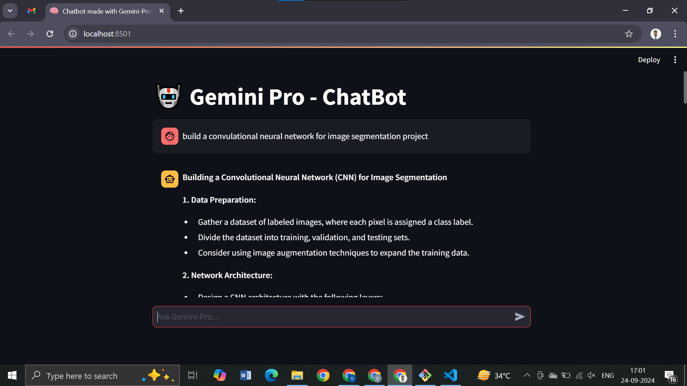
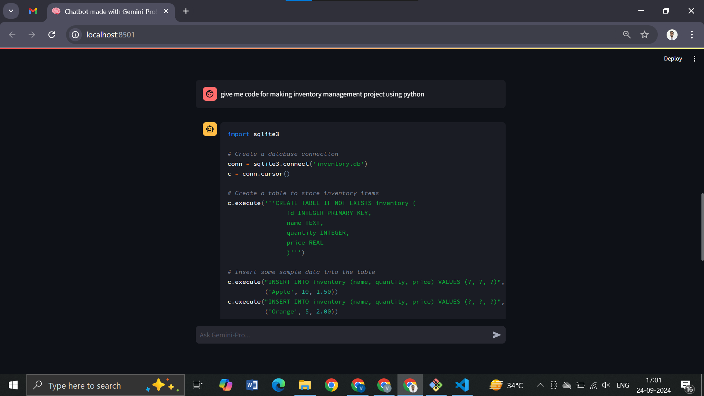

# 🤖 Chatbot using Gemini Pro 🧠🌐
## 📄 Overview
Welcome to the Chatbot using Gemini Pro project! 🚀 This repository showcases a powerful, AI-driven chatbot built using the Google Gemini Pro API and Streamlit. Designed to offer dynamic and intelligent conversations, this chatbot leverages advanced language understanding capabilities, providing users with an engaging and interactive experience. Whether you’re looking to automate customer support, create conversational assistants, or explore AI-driven dialogue systems, this project is your go-to solution! 💬✨

## 🔑 Key Features
- Gemini Pro Integration 🌟: Utilizes the cutting-edge Google Gemini Pro API to deliver highly accurate and context-aware responses, ensuring human-like interaction.
- User-Friendly Interface 🖥️: Built with Streamlit, offering a sleek and responsive web interface that allows you to chat effortlessly with the AI.
- Real-Time Interaction ⏱️: Provides instant responses, making the conversation feel natural and fluid.
- Customizable and Extensible 🔧: Easily tweak the bot’s behavior, responses, and styling to fit your specific needs, thanks to the modular and well-documented codebase.
- Rich Conversational Experience 🎙️: Supports a wide range of topics, delivering meaningful and contextually relevant answers to user queries.

🚀 Getting Started
Follow these steps to get the chatbot up and running on your local machine:

1. Clone the Repository
2. Install Dependencies
Make sure you have Python installed, then install the required packages:
```
pip install -r requirements.txt
```
3. Set Up Gemini Pro API Key
   Get your own API key from https://aistudio.google.com/app/apikey and modify the .env file with your own API key.
4. 4. Run the Chatbot
Launch the chatbot using Streamlit:
```
streamlit run main.py
```
## 🎨 Key Components
- Google Gemini Pro API: The heart of the chatbot, providing state-of-the-art natural language processing.
- Streamlit: Powers the web interface, making it easy to deploy and interact with the chatbot in real-time.
- Python Backend: Handles API requests and processes user inputs, maintaining a smooth conversational flow.
## 📊 Use Cases
- Customer Support: Automate responses to common queries, improving efficiency and availability.
- Virtual Assistant: Assist users with tasks, reminders, or answering general knowledge questions.
- Educational Tool: Use it as an interactive learning assistant for students and educators.
## Screenshots




